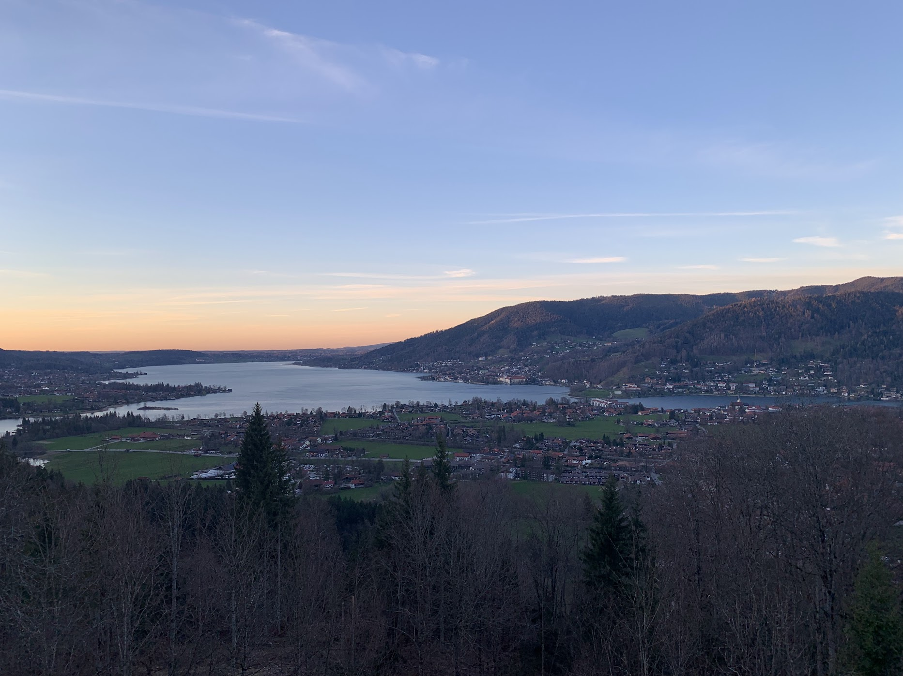

This is my first academic meeting! The topic is about my master thesis project, _**Scattering transform method on cosmological paramater constraints**_. And it happened in a castle! My topic is about my master thesis project, using scattering transform method to constrain cosmological parameters.  

<!--

 -->
This is a swimming pool in Ringberg. It looks really beautiful with snow-capped mountains in the distance, especially in a sunny day!

Tegernsee is one of my favorite, as beautiful as a painting

Thanks Leon Ecker for recording my first academic talk!

