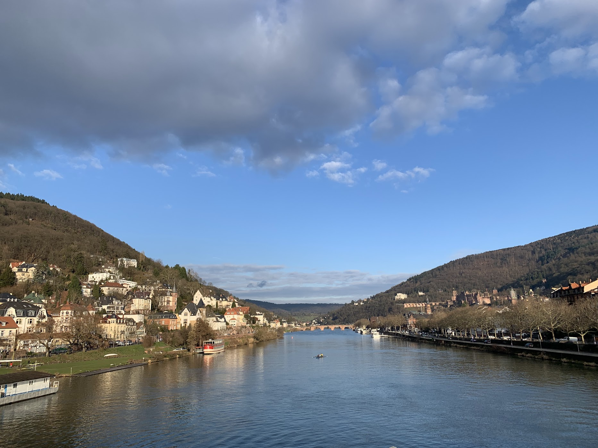

This is the cosmology meeting in between Munich region and Cambridge. My topic is about _**Probe Parity Violation with Weak Lensing Trispectrum**_

This is my first Cambridge-LMU Cosmology Meeting. And I gave me talk at my birthday! 

<!--
This is the <a href="https://chen-sijin.github.io/Sijin-Chen.github.io/files/talk_slides/2025-Cambridge-LMU_WL_trispectrum.pdf" target="_blank">slide</a> of my talk this time. 

The ITP building looks very nice, and the old castle look beutiful under the sunset

-->
