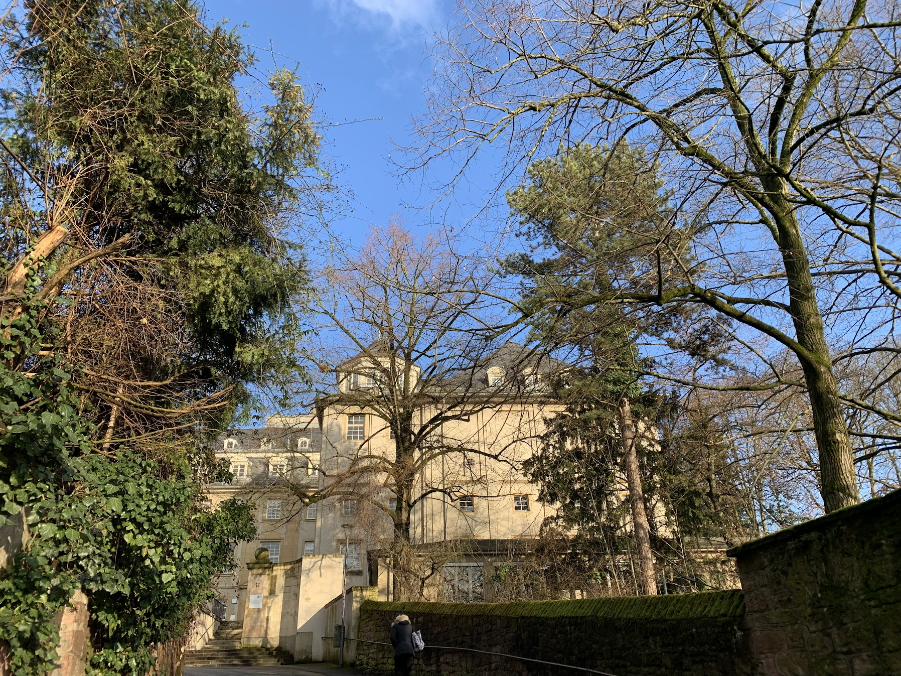
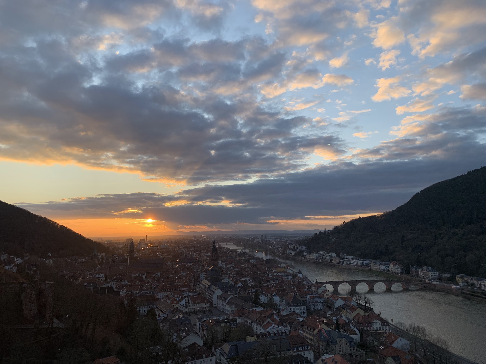

This is the cosmology and large scale structure [workshop](https://indico.ph.tum.de/event/7847/) in Munich region and other research institutes. This Munich LSS Days lasts from 2025-10-20 to 2025-10-21. My topic is about _**Probe Parity Violation with Weak Lensing Trispectrum**_
 

This is the <a href="https://chen-sijin.github.io/Sijin-Chen.github.io/files/talk_slides/2025_Munich_Large_Scale_Structure_Days.pdf" target="_blank">slide</a> of my talk this time. 

<!--

The ITP building looks very nice, and the old castle look beutiful under the sunset

-->
