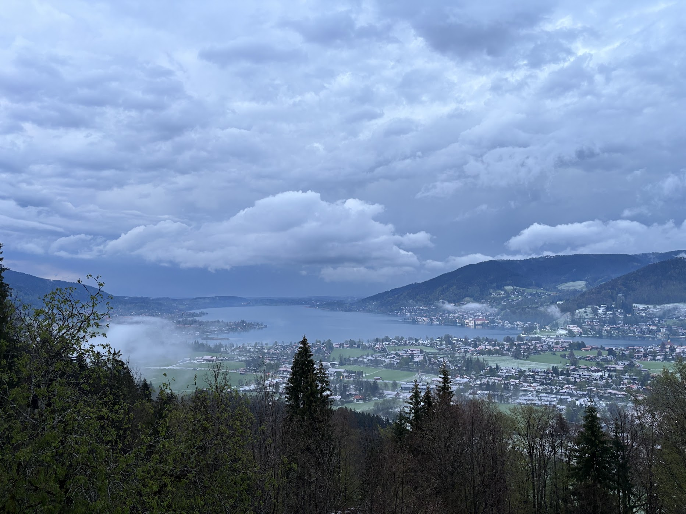
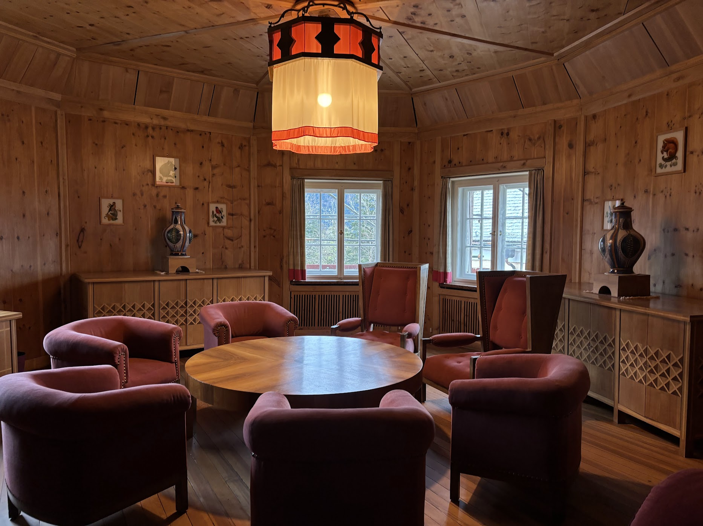

This Ringberg Conference lasts from *2025-04-22* to *2025-04-25*

This is my second Ringberg talk! The topic is about my master thesis project, _**Probe Weak Lensing Cosmology with Scattering Transform**_. And it happened in a castle! My topic is about my master thesis project, using scattering transform method to constrain cosmological parameters.  

This is the <a href="https://chen-sijin.github.io/Sijin-Chen.github.io/files/talk_slides/2025_Ringberg_talk.pdf" target="_blank">slide</a> of my talk this time. 

Again I am lucky to have the room facing Tegernsee!! (Only room 205 and 204 can have this view!). The cloud makes Tegernsee look nice

This is the place where we played "werewolf" at last night of this meeting!

