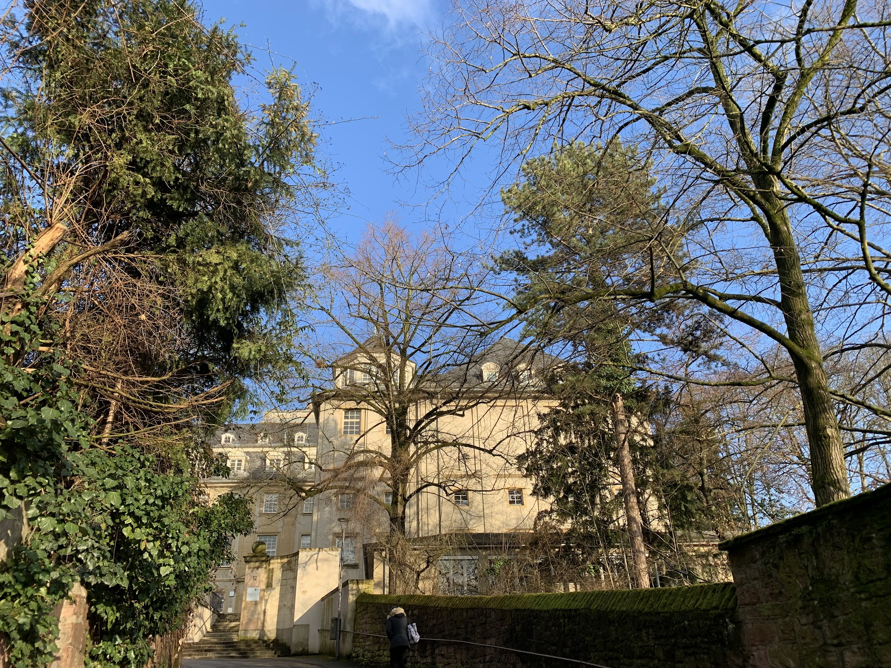
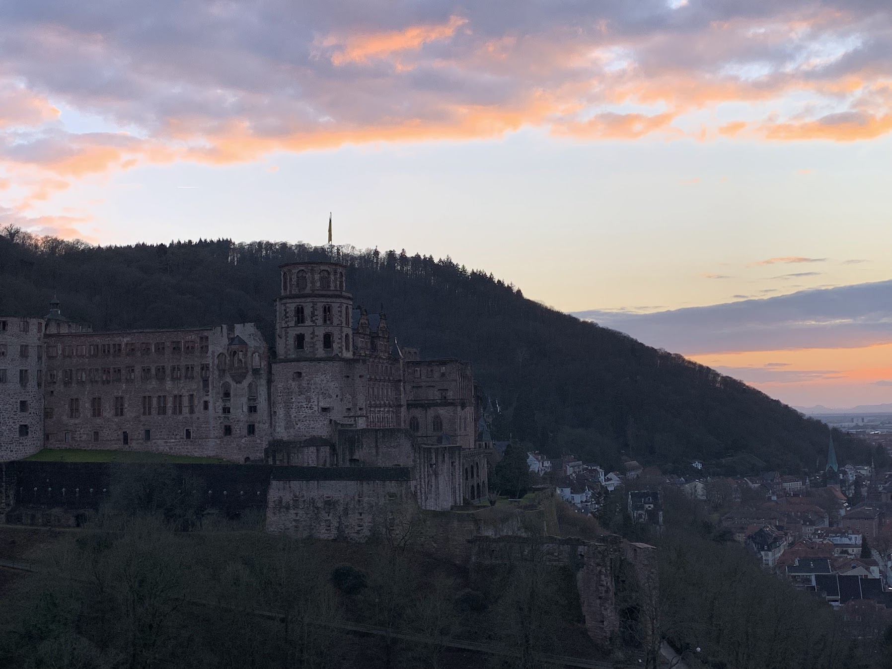
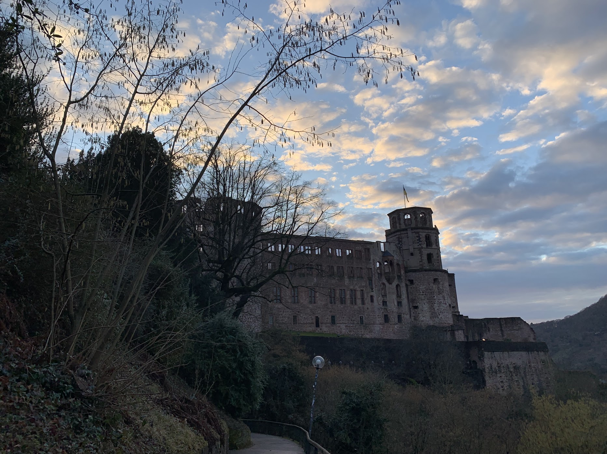
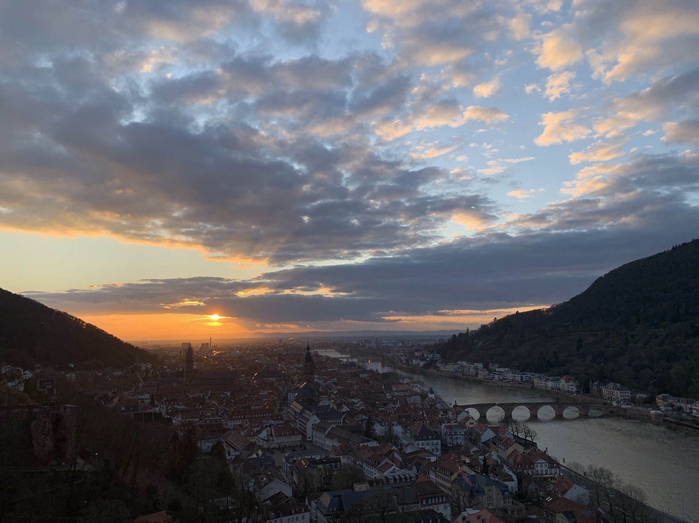
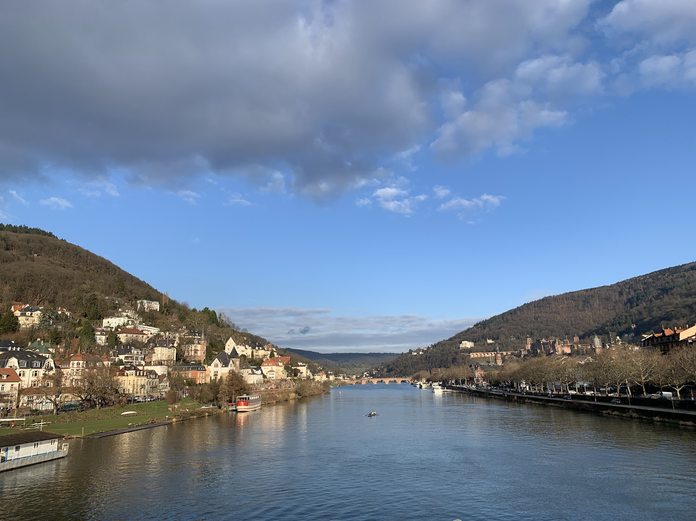

This is the *Parity from Home* online conference. This conference lasts from 2025-11-18 to 2025-11-21. I am very happy to have a change to talk about my current project. My topic is about _**Probe Parity Violation with Weak Lensing Trispectrum**_
 

This is the <a href="https://chen-sijin.github.io/Sijin-Chen.github.io/files/talk_slides/2025_Munich_Large_Scale_Structure_Days.pdf" target="_blank">slide</a> of my talk this time. 

I also got the chance to talk with so many senioir research scientists, and I am very happy that I have learned so many from them. 

<!--

The ITP building looks very nice, and the old castle look beutiful under the sunset

-->
